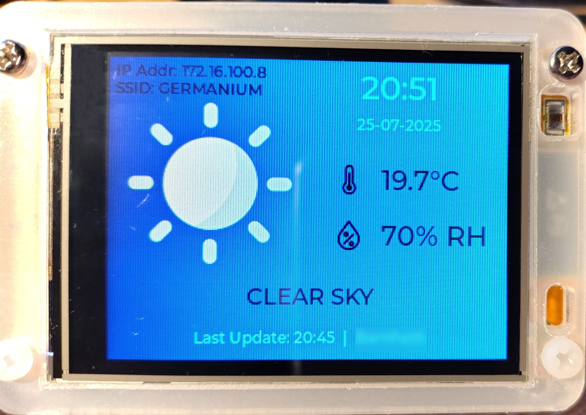
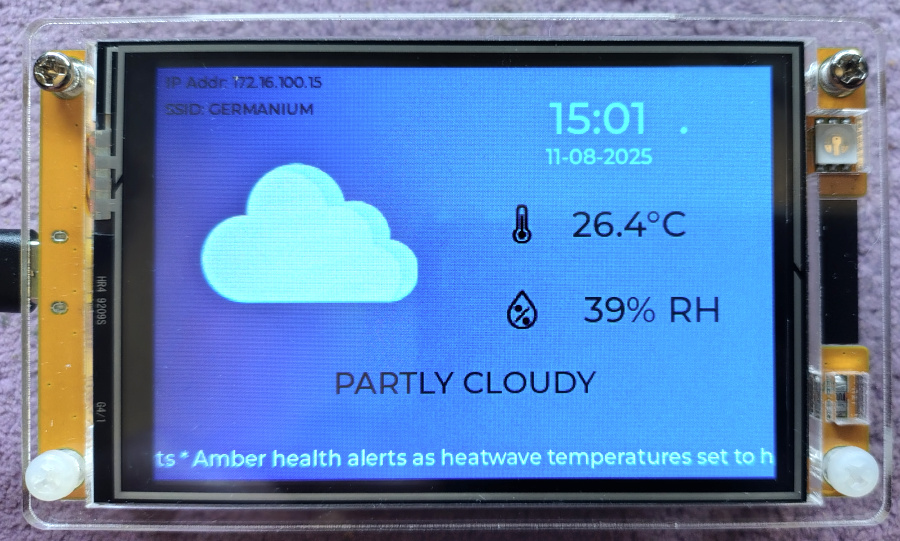

# ESP32CYD-LVGL-Weather
Weather Station and clock for the ESP32 Cheap Yellow Display (CYD) ESP32-2432S028R

I bought one of the above units to have a bit of fun and came across the excellent guides from Random Nerd Tutorials.

This code is based on their tutorial "ESP32 CYD with LVGL: Weather Station (Description, Temperature, Humidity)" at: https://randomnerdtutorials.com/esp32-cyd-lvgl-weather-station/ with the following changes:

* More accurate update of lv_tick_inc.
* RGB LED blink added (can be disabled).
* Optimised weather elements lookups.
* Changed background colour.
* Added time display using NTP server.
* Added flashing cursor. Changes to + when NTP fetch in progress.
* Added date format in DD-MM-YYYY (configurable in code).
* Local timekeeping. Updated from NTP every hour.
* Wifi info shown on screen.
* Wifi first connect max 10 retries.
* Will try to reconnect if wifi drops.

The code has also been tidied and optimised, with plenty of comments to explain the changes.

To use this code, follow the instructions in its comments or on the tutorials page mentioned above. Remember to set the user definable variables for wifi etc.

**Wrong Colours!!??**

If you find that your display colours are not as per the above image - especially if the background has a red tint - then your CYD was made by a manufacturer 
who used a slightly different display configuration. Unfortunately, this is a common problem. 

To fix this, locate the *User_Setup.h* file in the *TFT_eSPI* library folder and find the section as below. Follow the instructions, then save your change and recompile the code.

    // If colours are inverted (white shows as black) then uncomment one of the next
    // 2 lines try both options, one of the options should correct the inversion.

    // #define TFT_INVERSION_ON
    // #define TFT_INVERSION_OFF

You may also need to modify this section too:

    // For ST7735, ST7789 and ILI9341 ONLY, define the colour order IF the blue and red are swapped on your display  
    // Try ONE option at a time to find the correct colour order for your display

    // #define TFT_RGB_ORDER TFT_RGB  // Colour order Red-Green-Blue
    // #define TFT_RGB_ORDER TFT_BGR  // Colour order Blue-Green-Red

**Bought a 3.5" CYD!!??**

*3.5" CYD with updated code that includes a news ticker and item scaling.*

The 3.5" display variants aren't wired up the same way as the 2.8" ones. The User_Setup.h in this repo is a barebones one that seems to work with the 3.5" resistive CYDs available on AliExpress, but YMMV.

You don't need this file if you have a 2.8" CYD - although you may need to tweak the default file as above according to your display variant.

The download bundle from this manufacturer has resources and examples for 3.5" CYDs: https://www.tztstore.com/goods/show-8217.html

*11 Aug 2025: The new code that fully supports 3.5" displays and the (optional) news ticker will be available shortly.*

